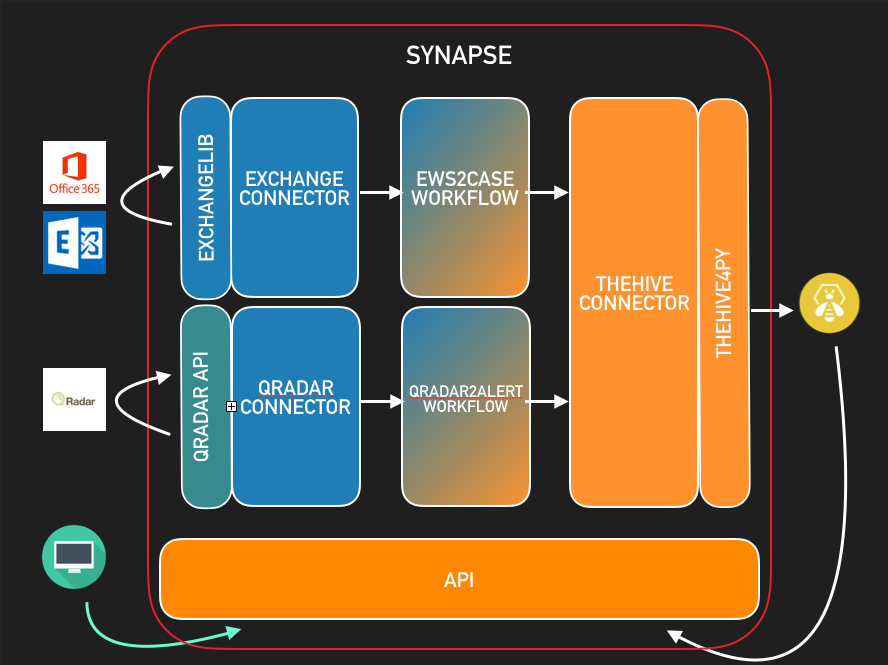

Synapse is a free, open source meta alert feeder that allows you to feed [TheHive](https://github.com/TheHive-Project/TheHive) from multiple alert sources at once.   
It leverages TheHive's API to automate case and alert creation. Thanks to Synapse, you can swiftly create cases or alerts in TheHive out of email notifications or SIEM events.

Currently, Synapse supports the following alert sources:

- Microsoft Exchange
- Microsoft O365
- IBM QRadar  

# Overview

Most of the time, transforming a security event or a notification about a suspicious email requires several actions and conditions.  Synapse gathers those into workflows.   

In order to have the most user-friendly application possible, we decided to put an API on top of these workflows.   That way, you would only execute the workflow you are interested in by "hitting" the corresponding API endpoint.   

The following workflows are currently supported by Synapse:
   * Case creation from email using Exchange Web Service & O365
   * Alert creation from QRadar offenses



For a detailed explanation of each workflow,  please have a look at the [workflows page](docs/workflows/README.md).   

# Using Synapse

The [user guide](docs/user_guide.md) should contain all the information you need. In short:

   1. Install dependencies
   2. Fill in the config file
   3. Execute: ```python3 app.py```

While all operating systems running Python 3 can be used for Synapse, we recommend the use of Ubuntu.   

# License
Synapse is an open source and free software released under the 
[AGPL](https://github.com/TheHive-Project/TheHive/blob/master/LICENSE) (Affero General Public License). 
We, TheHive Project, are committed to ensure that TheHive will remain a free and open source project on the long-run.

# Updates
Information, news and updates are regularly posted on [TheHive Project Twitter account](https://twitter.com/thehive_project) and on [the blog](https://blog.thehive-project.org/).

# Contributing
Please see our [Code of conduct](code_of_conduct.md). We welcome your contributions. Please feel free to fork the code, play with it, make some patches and send us pull requests via [issues](https://github.com/TheHive-Project/Synapse/issues).

# Support
Please [open an issue on GitHub](https://github.com/TheHive-Project/Synapse/issues) if you'd like to report a bug or 
request a feature. We are also available on [Gitter](https://gitter.im/TheHive-Project/TheHive) to help you out.

If you need to contact the project team, send an email to <support@thehive-project.org>.

# Community Discussions
We have set up a Google forum at <https://groups.google.com/a/thehive-project.org/d/forum/users>. To request access, you need a Google account. You may create one [using a Gmail address](https://accounts.google.com/SignUp?hl=en) or [without it](https://accounts.google.com/SignUpWithoutGmail?hl=en).

# Website
<https://thehive-project.org/>

# Roadmap

   * Closing QRadar offense after closing TheHive case or alert
   * Scheduler to periodically execute workflows

## Special Thanks

Kudos to [Erik Cederstrand](https://github.com/ecederstrand) for his amazing work on Exchangelib. 

We also would like to thank the IBM team for providing a Python [QRadar API client](https://github.com/ibm-security-intelligence/api-samples) to the community.
