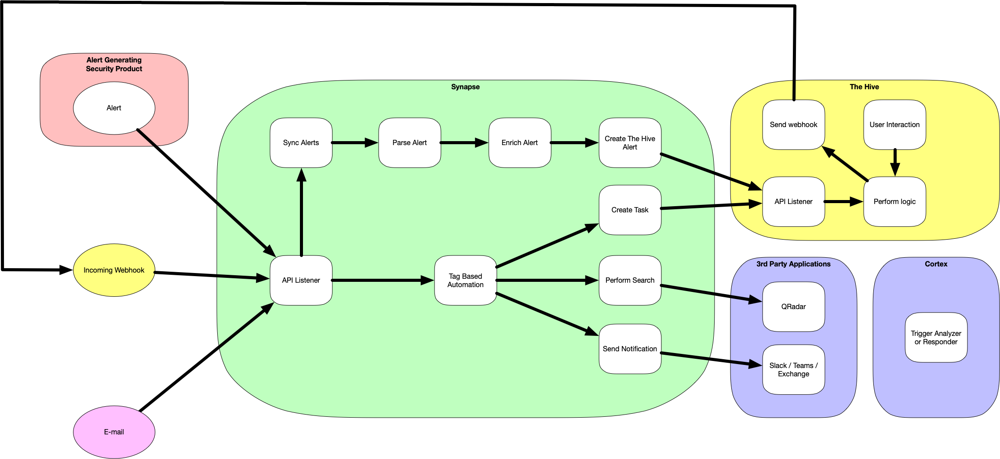

# Synapse

Synapse is a middleware application that allows you to connect TheHive with other (security) solutions and automate your incident handling.   
It leverages TheHive API  to automate case and alert creation.   

Synapse will greatly aid you in achieving higher efficiency when it comes to incident handling and response.

## Big Picture
Security alerts can come from a great variety of places. Cloud Security Services, SIEMS, EDR, Antivirus and more are all tools that can generate these events.
It is very beneficial to receive all these alerts in one unified place, which for those who come across this framework is most likely The Hive. As this is epic tool to register and handle their events it has limited functionality when it comes to automation. Hence Synapse!

Most of the time, the alerts mentioned earlier are part of a use case that implies several actions and conditions.  
Synapse gathers those into a unified configuration based on your own identifiers.   

The current features that are implemented at the moment are:
   * Integration
      * QRadar
      * Elasticsearch (Logstash output, Watcher alerts)
      * EWS (Reading E-mails from a mailbox)
   * Automation
      * Tag based automation
   * Automation Tasks
      * The Hive
         * Create Tasks
      * Cortex
         * Send notifications through the Mailer responder
      * QRadar
         * Query QRadar through AQL to enrich alerts or add data to cases
      * Slack
         * Send notifications to a channel
      * Teams
         * Send notifications to a channel
      




For detailed explanation on each workflows, have a look at the [workflows page](docs/workflows/README.md).   

## How to use

Have a look at the detailed [user guide](docs/user_guide.md), but in short:

   1. Install dependecies
   2. Fill in the config file
   3. Execute: ```python3 app.py```

While all OS running python3 can be used for Synapse, we recommend the use of Ubuntu.   

## Roadmap

   * Alert creation from QRadar offense
   * Closing QRadar offense after closing TheHive case or alert
   * Scheduler to periodically execute workflows

## Special thanks
Kudos to ninsmith for creating the first version of Synapse of which this enhanced version has been built

Kudos to everyone who has showed me how they use tools around The Hive to enrich and automate their alerts and processes.
It is very hard to remember pieces of code I received from various people. If you recognize your code and would like to be mentioned. Please let me know!

Kudos to Erik Cederstrand for his amazing work on Exchangelib.   
Check his others projects [here](https://github.com/ecederstrand).   

Kudos to IBM teams for providing a python QRadar API client to the community.   
Check it [here](https://github.com/ibm-security-intelligence/api-samples).   

## Python naming convention
https://www.python.org/dev/peps/pep-0008/#package-and-module-names