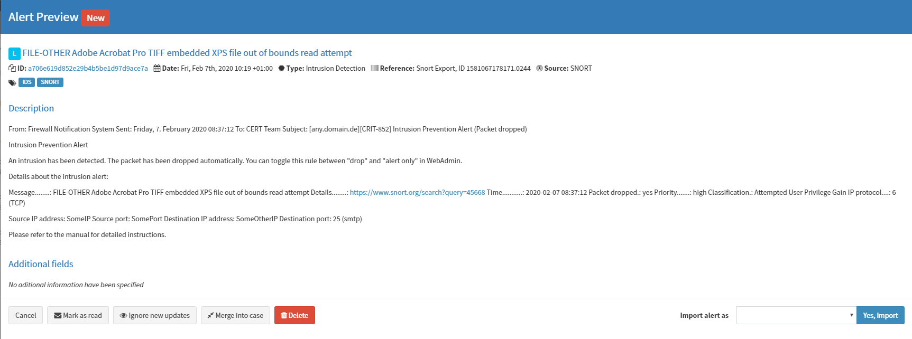

# Ews2Alert


+ [Demo](#demo)
+ [Configuration](#configuration)
    + [Exchange server](#exchange-server)
    + [ews2Alert config](#ews2Alert-config)
+ [Links and Information](#links-and-information)
    + [Cronjob](#cronjob)
    + [REGEX](#regex)

```Ews2Alert``` is a modification of ```Ews2Case``` to facilitate Alert creation (instead of Cases) from Microsoft Exchange E-Mail.

This workflow is intended for all IDS E-Mail Notifications or security relevant E-Mails that are not automatically "Case-Worthy", but rather should be looked at as an initial alert and made into cases on an "alert-by-alert" basis by a Team-Member.

Key differences to Ews2Case:

- You can't use the "Assign via Category" functionality due to how alert creation works
- Alerts created will not update themselves "out of the box".
- Ews2Alert is intentionally left highly self configurable due to how many different Use-Cases for E-Mail imports exist.

## Demo

Our fictional Company is using a Sophos UTM Firewall with Packet Inspection (SNORT) aktive.

Whenever SNORT detects potentially malicious activity, it reports said activity to a mailbox called IT-Sicherheit.


In our case, this E-Mail gets auto-sorted into the folder "TheHive" based on rules set in the mailbox itself.


Now, either a team member can manualy trigger the ```ews2Alert``` workflow by either using Curl:

```
curl some.fictionaldomain.com/ews2alert
```

or, like in our demo, by setting up a Cronjob locally on the TheHive server to do this automatically in a set time interval.

```
* * * * * curl --silent http://localhost:5000/ews2alert
```

This particular Cronjob triggers the ews2alert workflow every minute of every hour for every day. For more information about Cronjobs please look at the chapter "Links and Information" at the end of this document.

In case an alert creation fails, the logs to troubleshoot the issue are located at ```Synaspe/logs/synapse.log```.


TheHive UI now shows a new created Alert.


Due to the way this particular demo was configured, the ```title``` was populated with the actual intrusion type instead of for example the subject of the E-Mail.

In the case of our demo company and its SNORT setup, this is to prevent all created alerts from only displaying "[any.domain.de][CRIT-852] Intrusion Prevention Alert (Packet dropped)" as a ```title```, making intresting reports not immediatly visible. This is because this demo companys SNORT alerts do not come with their own unique identifier in the subject.





As you can see, the description and other fields of the alert have been populated.

## Configuration

### Exchange server

For configuration of the EWS module, please see the documentation of "Ews2Case", specifically the point "Exchange server".


### ews2Alert config

You can configure the ews2Alert workflow by navigating to your Synapse workflow folder and using nano.

```cd YourPathToSynapse/Synapse/workflows```

```sudo nano ews2Alert.py```

The default configuration part looks like this:

```
title = msg.subject
description = msg.text_body
severity = 2
date = time.time() * 1000
tags = "YourTag1","YourTag2"
tlp = 2
status = "New"
type = "YourTypeHere"
source = "YourSourceHere"
sourceRef = "Snort Export, ID " + str(date)
artifacts = ""
caseTemplate = ""
```

Explanations:

```title = msg.subject```

The default title of the alert is the E-Mail subject

If you want to change the title of your alert to something more like shown in the demo, you can use Pythons ```regex``` to for example search for specific strings in the Mail-Body.

In the case of the demo, we used
```
title = re.search('(?<=Message........: )(.*)(?=\n)', msg.text_body).group(1)
```
to search the E-Mail body (```msg.text_body```) for everything behind ```Message........: ``` and before the next new line. In case of the demos SNORT alerts, this will yield the intrusion type as a title.

For more information on how to use ```regex``` and a builder for your custom string, please see the "Links and Information" chapter at the end of this document.

```description = msg.text_body```
The default description of the alert is the Mail body (This was used in the demo).

```severity = 2```
The default severity (This was used in the demo).

```date = time.time() * 1000```
The date when the alert was created, which in this case is the time of import into TheHive.

```tags = "YourTag1","YourTag2"```
The default tags, seperated by comma (The demo used "IDS","SNORT").

```tlp = 2```
The default tlp (This was used in the demo).

```status = "New"```
The default status (This was used in the demo).

```type = "YourTypeHere"```
The default type (The demo used "Intrusion Detection").

```source = "YourSourceHere"```
The default source (The demo used "SNORT").

```sourceRef = "YourSourceRefHere"```
The default sourceRef. For the demo, we generated a unique ID for the ```sourceRef``` variable by appending the ```date``` variable behind a string:
```"Snort Export, ID " + str(date)```

```artifacts = ""```
The default artifacts, in this case empty.

```caseTemplate = ""```
The default case Template, in this case empty.

## Links and Information

### Cronjob
For a good reference site for Cronjob creation, please look at [this](https://linuxconfig.org/linux-crontab-reference-guide) website

### REGEX

[REGEX 101](https://regex101.com/) is a great site to read up on and test out REGEX strings on your own text. For example, [this](https://regex101.com/r/cO8lqs/17290) is the REGEX builder string used in the demo.
