# Ews2Case

+ [Demo](#demo)
    + [Automatic case creation](#automatic-case-creation)
    + [Automatic case assignment](#automatic-case-assignment)
    + [Communication task](#communication-task)
    + [Attachments handling](#attachments-handling)
    + [Email replies](#email-reply-added-to-the-case)
+ [Configuration](#configuration)
    + [Exchange server](#exchange-server)
    + [Username](#username)
    + [Password](#password)
    + [Auth Type](#auth-type)
    + [Smtp address](#smtp-address)
    + [Folder name](#folder-name)
+ [Additional Set-Up](#additional-set-up)
    + [Categories](#categories)
    + [Exchange web certificate](#exchange-web-certificate)
    + [Special folder](#special-folder)

```Ews2Case``` is the workflow related to case creation from Microsoft Exchange emails.   
It works with corporate Exchange servers and with online outlook accounts even if the workflow sligthy differs depending on the platform you use.   

Let's show case the workflow first and then explain how to configure it. 

## Demo

Emma and Bertram work at Stargazer CERT as incident handler.

Eve, who works as a secretary, wrote to the cert mailbox to report a suspicious email. In her email, she attached as a file attachment the email she received (```.msg```).

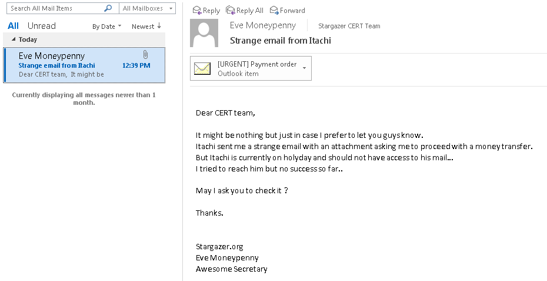

### Automatic case creation

Emma saw it first and tagged the email with her "Outlook category" so Bertram does not work on it at the same time.

> ee0091 is her username both in AD and TheHive.

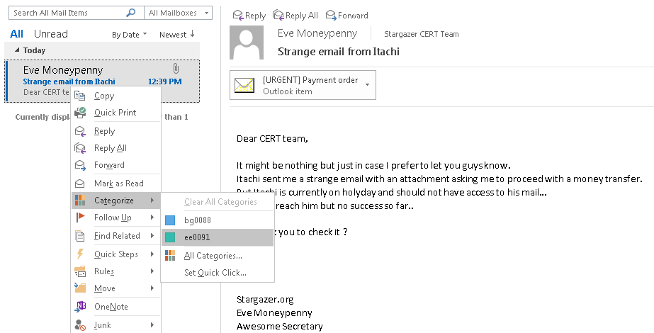

The email is now categorized.

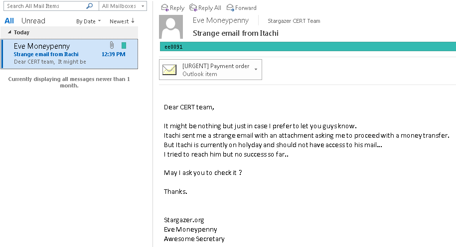

Then she drags and drops the email **unread** to the folder named "TheHive".

> Because all emails are not meant to create a case, only email in "TheHive" folder will trigger the workflow.

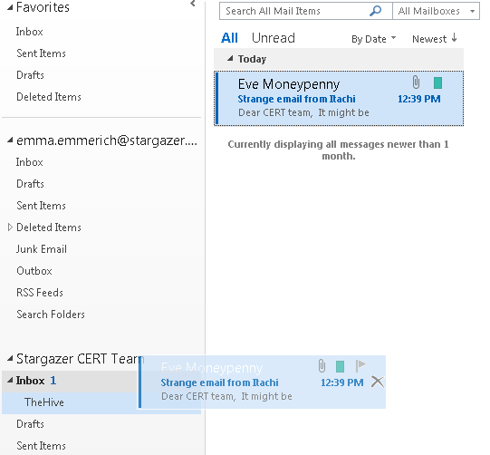

Below we can see the email **unread** in "TheHive" folder:

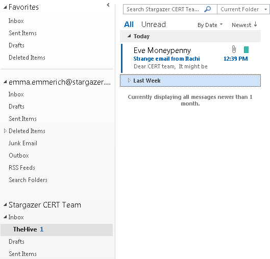

Now, Emma does a simple GET request to Synapse:

```
curl synapse.stargazer.org/ews2case
{"success":true}
```

As we can see, the API returned a ```{"sucess":true}```.
In case it would have been ```{"success":false}```, the logs to troubleshoot the issue are located at ```Synaspe/logs/synapse.log```.

> In the Stargazer context, Synapse fqdn is ```synapse.stargazer.org```. It will most likely change within **your** organization. The only thing that will not change is ```/ews2case```, this is the API endpoint to execute the EWS workflow.


Let's have a look at TheHive UI:

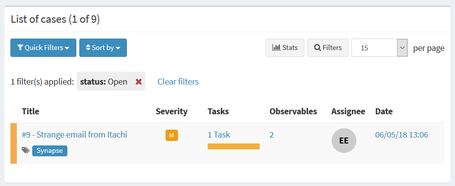

A case has been created and named "Strange email from Itachi".
If you recall, it is the subject from Eve's report.

### Automatic case assignment

In the case details, we can see the below:

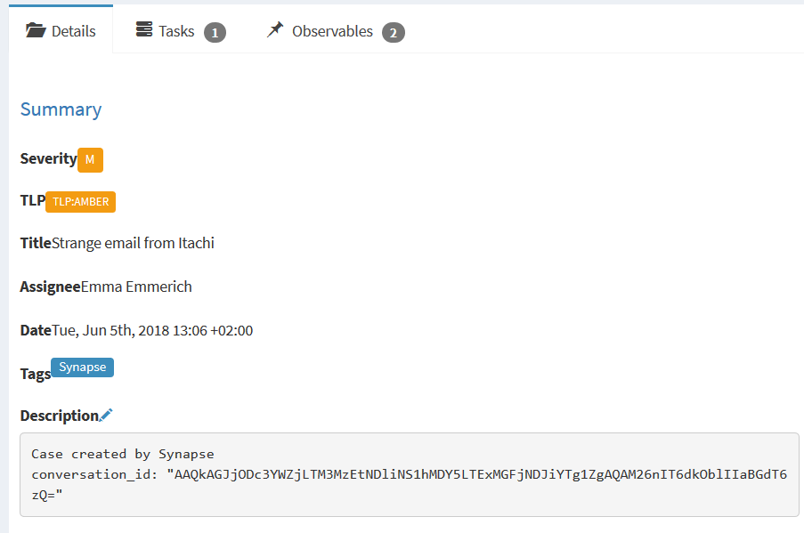

Synapse has assigned the case to Emma, added a tag ```Synapse``` and a description (which we will talk about later).

> Because Emma categorized the email with her username, Synapse assigned it to her. If she would have forgotten to categorize the email, the case would have been assigned to Synapse.

### Communication task

Moreover, Synapse created a task named "Communication":

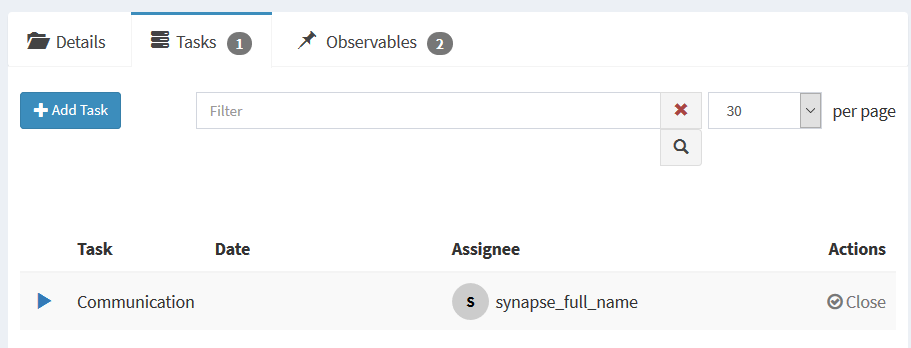

Inside, it has logged the email body from Eve to the CERT:

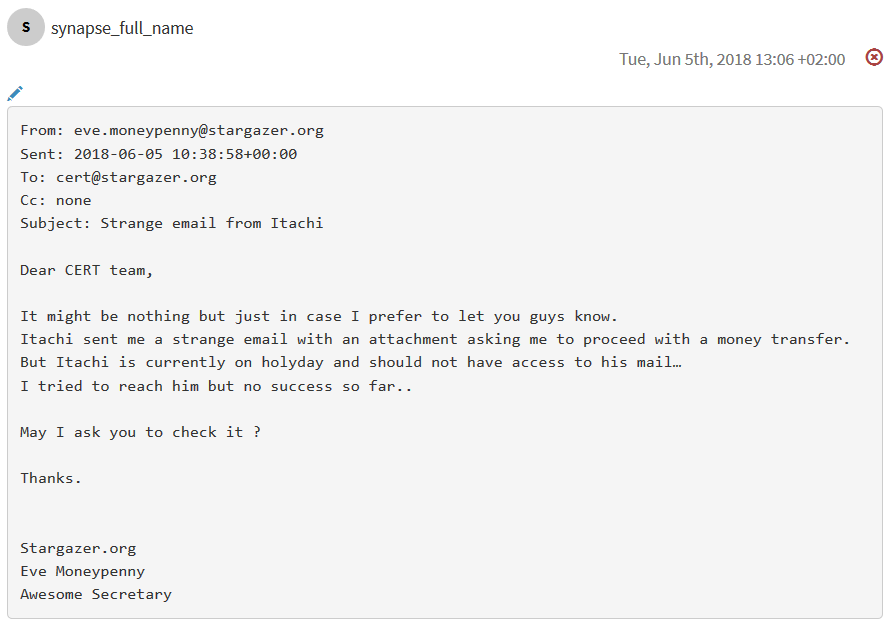

### Attachments handling

Synapse has also converted the ```.msg``` to a ```.eml``` and has added it to the case as observable.
But don't worry about the attachment Eve talked about, it has been extracted and added to case as well (```order.pdf```):

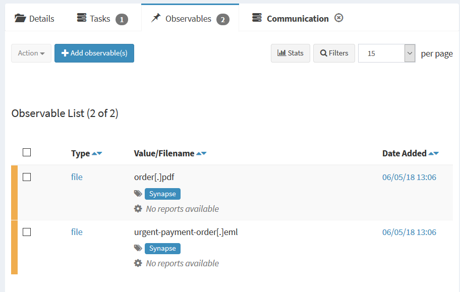

Regarding the ```.eml```, its description as file observable always includes context such as sender, receiver and subject:

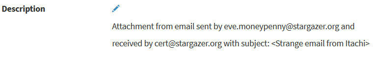

You could also use the ```Eml Parser``` analyzer to have more details about the ```.eml``` without actually opening the suspicious email:


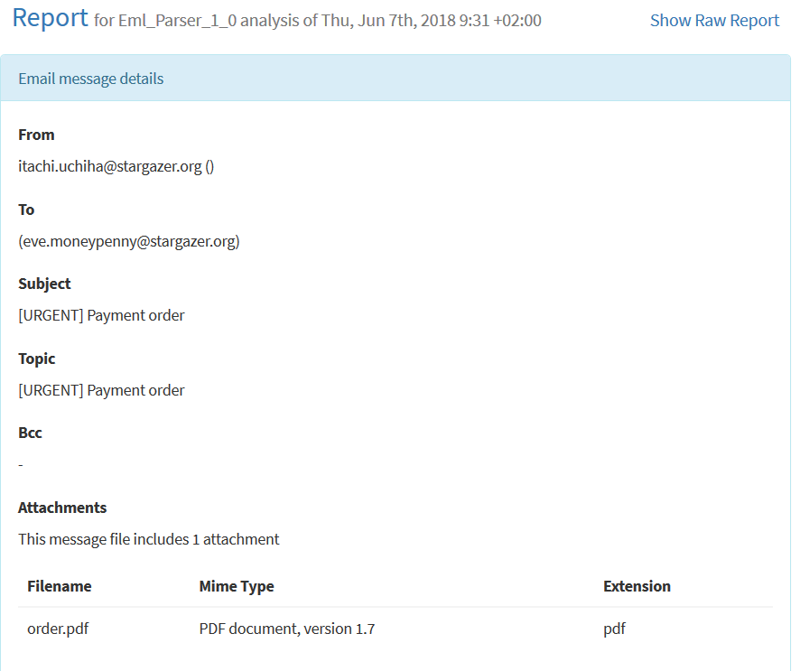
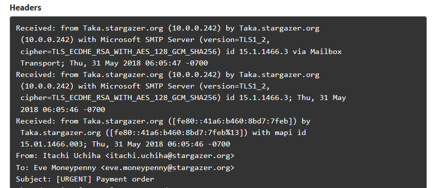


### Email reply added to the case

Emma answers back to Eve and CCed the team mailbox:


Again, she drags and drops the email **unread** to "TheHive" folder and does a GET request to Synapse:

```
curl synapse.stargazer.org/ews2case
{"success":true}
```

Synapse does not create a new case but adds the email body to the "Communication" task:

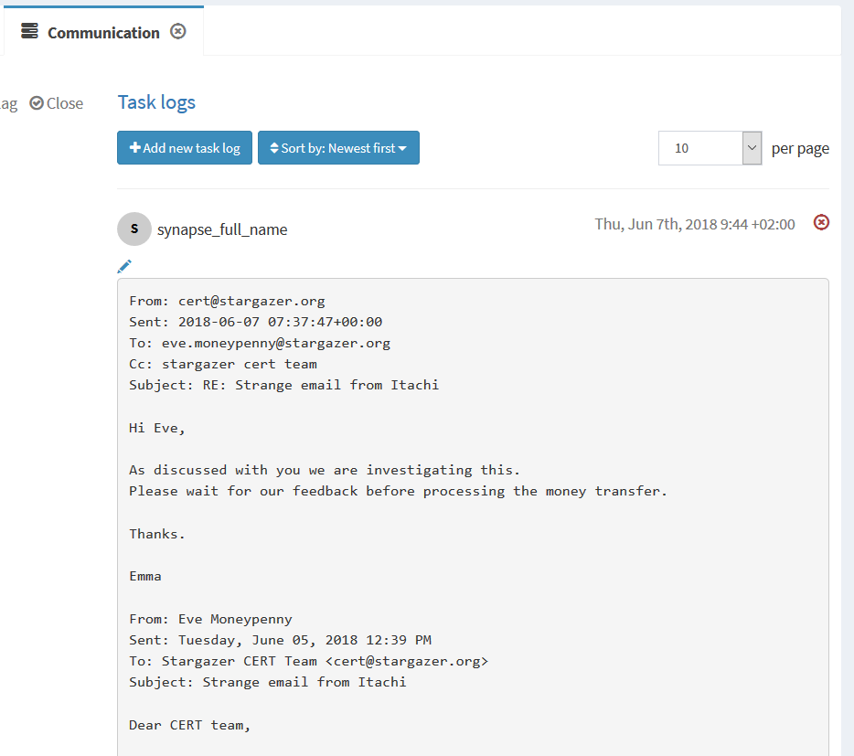

> Each email has a conversation_id. When a case is created from an email, the conversation_id is added to the case description. That's the trick Synapse uses to know if it needs to create a new case or add the email body to case already created.


## Configuration

Now that you have more insight of what is done with ```Ews2Case```, let's configure Synapse.
The configuration is located at ```Synapse/conf/synapse.conf``` and we will fill in the ```[EWS]``` section.   

### Exchange server

Under the ```server``` option, fill in the fqdn or the ip of the server you want to pull email from.   

#### Example

```
server:outlook.live.com
```

### Username

To connect to the server, Synapse needs a valid username for authentication.   
If you use the free web version of outlook, put down the email address you want to pull emails from.   
If you are in a corporate context, put down a username from an account allowed to access the mailbox you target. Make sure to prefix the username with your Windows domain.   

#### Example

```
username:foo@outlook.com
```
If corporate context:

```
username:stargazer.org\bg0088
```

### Password

The password linked to the username you previously put.

#### Example

```
password:v3ryC0mplxPwd
```

### Auth Type

Auth type used in the account config when connecting to EWS.   
By default, the auth type is set to ```NTLM```. In most of the cases, you do not need to edit this value.   

However, for O365, this field needs to be set to None: ```auth_type:None```.

At the moment, only ```NTLM``` and ```None``` auth type are implemented in Synapse.

#### Example

```
auth_type:NTLM
```

### Smtp address

The email address you would like to pull emails from.

#### Example

```
smtp_address:foo@outlook.com
```

### Folder name

Synapse will scan for unread emails addressed to the email address your previously stated **and** those must be in a specific folder.   
That way not all emails trigger a case.

#### Example

```
folder_name:TheHive
```

## Additional Set-Up

Now the configuration file should be filled in, but you still have to do some actions.

### Categories

For each user in TheHive, create a categorie in Outlook labeled with the user's username in TheHive.
This allows automatic case assignment.
See [this](#automatic-case-creation) and [this](#automatic-case-assignment) for more details.

### Exchange web certificate

You most likely will need to provide to Synapse the Exchange web certificate (especially if you have an on premises Exchange server).   
To do so:

   * Go to your corporate Outlook Web App (most likely located at ```https://email.<YOUR_DOMAIN>```)
   * Extract the certificate from your browser
   * Upload it to ```/usr/local/share/ca-certificates/extra``` on Synapse server
   * Edit ```/etc/environment``` and add the following line

```
REQUESTS_CA_BUNDLE=/usr/local/share/ca-certificates/extra/<YOUR_CERT_FILENAME>
```

### Special folder

If you have not already done, create a specific folder which Synapse will scan for unread emails.
