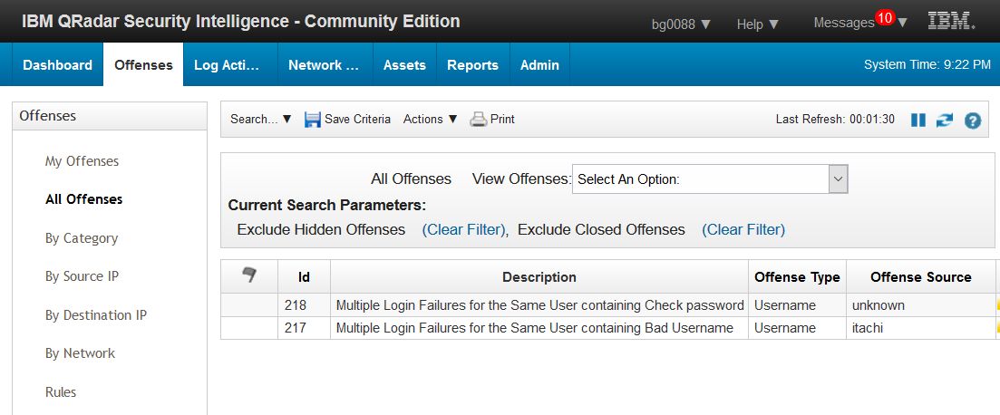
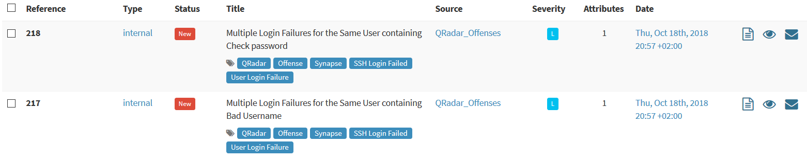
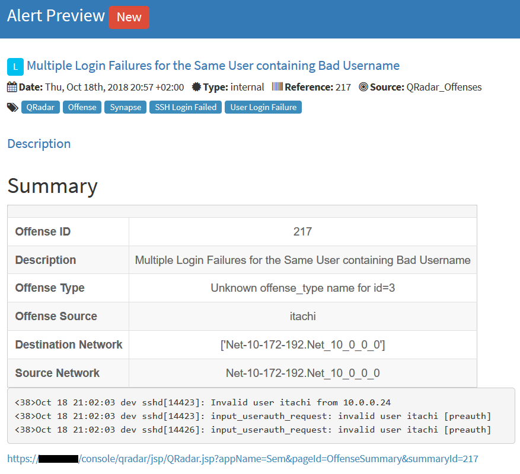
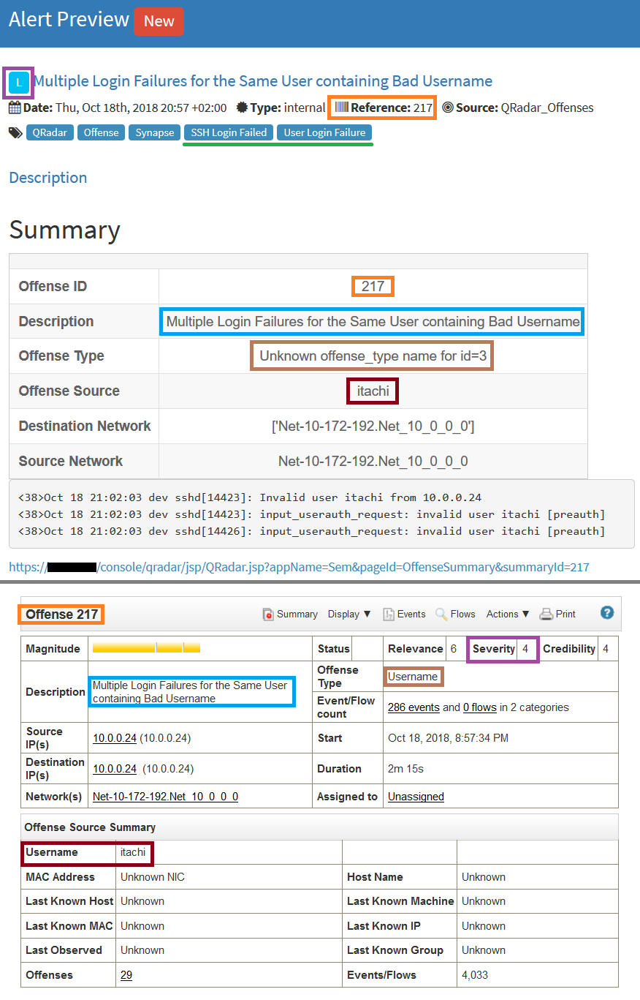

# Qradar2alert

+ [Demo](#demo)
    + [Automatic alert creation](#automatic-alert-creation)
    + [Automatic observable creation](#automatic-observable-creation)
    + [Closing QRadar offense from TheHive](#closing-qradar-offense-from-thehive)
+ [Configuration](#configuration)
    + [QRadar server](#qradar-server)
    + [QRadar Auth token](#qradar-auth-token)
    + [QRadar certificate](#qradar-certificate)
    + [QRadar API version](#qradar-api-version)
+ [Additional Set-Up](#additional-set-up)
    + [TheHive webhook to Synapse](#thehive-webhook-to-synapse)


```QRadar2alert``` is the workflow related to alert creation from QRadar offenses.

It leverages the QRadar REST-API thanks to the IBM python client which has been slightly modified to fits inside Synapse.   
The original client can be found [here](https://github.com/ibm-security-intelligence/api-samples).

Let's show case the workflow first and then explain how to configure it.

## Demo

Emma and Bertram work at Stargazer CERT as incident handler.
Stargazer has recently deployed IBM QRadar as their SIEM and Bertram is in charged of monitoring it for incoming offenses (which are alerts in the QRadar jargon).

### Automatic alert creation

During one of his shift, two offenses are fired:



As his shift is about to end, he decides to raise alerts in TheHive for both offenses so Emma can take over them and investigate.   
To do so, he leverages Synapse API and executes the following POST request:

```
curl --header "Content-Type: application/json" --request POST --data '{"timerange":10}'  http://synapse.stargazer.org/QRadar2alert
```

which returns:

```
{
    "offenses": [
        {
            "qradar_offense_id": 218,
            "raised_alert_id": "221a910cad183cea6eed86bd9b24a987",
            "success": true
        },
        {
            "qradar_offense_id": 217,
            "raised_alert_id": "73a00c9c7d2a36694f0fabcbd6e52bd3",
            "success": true
        }
    ],
    "success": true
}
```

>"timerange":10 orders Synapse to import every offense created during the last ten minutes as alert in TheHive.

Emma connects to TheHive and in the "List of alerts" sees two alerts:



She then decides to have a closer look at the one referenced as ```217``` and previews it:



She is displayed with some metadata related to the offense, the first three logs that triggered it and a link to open it in QRadar.


>Before going further, let's have a quick look to the data binding. In the first half of the below picture is TheHive display of the offense and the second half QRadar's:



>As you can see, Synapse tried to import the most relevant data. You may also notice that Synapse did not manage to import correctly the Offense Type (in brown). It should be "Username" but in the preview it is "Unkown offense_type name for id=3". This is related to a bug in the QRadar API, it has been already raised to IBM.

### Automatic observable creation

At this point, she thinks this needs to be investigated and imports the alert as a case.   
Good thing is, the source of those failed SSH login, IP ```10.0.0.24``` is automatically added as an observable during the promotion to case:


### Closing QRadar offense from TheHive 

After digging into it, Emma concludes it is a false positive and close the case on TheHive side.   
Which means she probably should close the offense on QRadar side as well...   

Since Synapse is a REST API, it listens for requests.   
By configuring TheHive to target Synapse with its webhooks, Synapse is aware off all activity going on in TheHive.   
As such, when:

   * a QRadar alert is marked as read
   * a case, opened from a QRadar alert, is closed
   * a case, created from merged cases where at least one of them is related to a QRadar alert, is closed

Synapse is able to close the related offense in QRadar.   
Note that deleting a "QRadar case" will not close its offense.

## Configuration

Now that you have more insight of what is done with ```QRadar2Alert```, let's configure Synapse.   
The configuration is located at ```Synapse/conf/synapse.conf``` and we will fill in the ```[EWS]``` section.

### QRadar server

Under the ```server``` option, fill in the fqdn or the ip of QRadar.   
The value will be used to interract with QRadar but also generates the url to offenses.   

#### Example

```
server:qradar.stargazer.org
```

or

```
server:10.0.0.14
```

### QRadar Auth token

Synapse uses the QRadar API to get and close offenses.   
In order to authenticate against the API, generate an auth_token in QRadar and fill the ```auth_token``` option with it.   


#### Example

```
auth_token:0d3bcc3e-d46f-4e8b-a434-e1027776cc96
```

### QRadar certificate

You need to provide QRadar certificate to Synapse to avoid any SSL issues.   
To do so:

   * Go to QRadar web interface
   * Extract the certificate from your browser (b64)
   * Upload it to Synapse server
   * Put the full file path to the certificate in the config file

#### Example

```
cert_filepath:/home/synapse/qradar.crt
```

### QRadar API version

As several API versions are supported by QRadar, you can choose which one to use in Synapse.   
By default the version used is ```8.0```, you can keep this setting unchanged.   

#### Example

```
api_version:8.0
```

## Additional Set-Up

### TheHive webhook to Synapse

To close QRadar offense after closing a QRadar case, make sure to configure TheHive to fire all webhooks to Synapse.   
Specifically on the ```/webhook``` endpoint.    

Below a sample of TheHive's ```application.conf```: 

```
webhooks {
  myLocalWebHook {
    url = "http://synapse.stargazer.org/webhook"
  }
}
```

In this example, Synapse has been configured to be reached on port 80 at ```synapse.stargazer.org``` but adapt this to your context.   
If you keep the default port and if TheHive and Synapse are on the same server, you would end up with:

```
webhooks {
  myLocalWebHook {
    url = "http://127.0.0.1:5000/webhook"
  }
}
```
